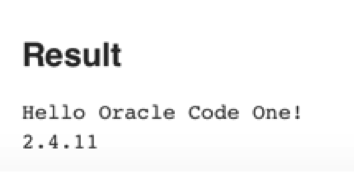
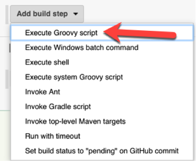

## Step 2: Basic Jenkins Scripting

### 2.1 - Run your first Groovy script in Jenkins

Let&#39;s confirm what version of Groovy is being used in Jenkins.

1. On the left navigation, click &quot;Manage Jenkins&quot;

_Note: Jenkins may tell you that you aren&#39;t the latest version. Just ignore this. (We wanted everyone to be on a version we tested with.)_

1. Click &quot;Script Console&quot;

1. Write:
```groovy
println 'Hello Oracle Code One!'
println GroovySystem.version
```
3. The result is right below the text area:
1. Add a Groovy build step
 


### 2.2 - Run your first job containing Groovy scripting

1. In the left navigation, click &quot;New item&quot;

1. Enter &quot;my-first-script&quot; as the job name and choose &quot;Freestyle Project&quot;
 

1. Scroll down and click &quot;Ok&quot;

1. Add a Groovy build step
 

1. Choose &quot;Groovy 2.X&quot; to run that Groovy version.s

1. In the textbox, enter the code
```groovy
println 'Hello Oracle Code One!'
println GroovySystem.version
```
 

7. Click &quot;Save&quot;

1. Click &quot;Build Now&quot;

1. Click your job number and view the Console Output.

_Tip:_ You can click the circle to go directly to the console.
 

10. Note that Jenkins installed Groovy the first time it was needed.


### 2.3 - Writing your own script in Jenkins

This time we are going to write a script where you fill in the blank to print out all the strings that end with &quot;day&quot;.

_Tip_: If you&#39;ve never used Groovy before, see the solution guide for how to do this. (also note that Groovy uses grep where Java uses filter)

def list = [&#39;monday&#39;, &#39;wednesday&#39;, &#39;chocolate&#39;, &#39;friday&#39;]

println \_\_\_\_\_\_\_\_\_\_\_\_\_\_\_\_\_\_\_\_\_\_\_\_\_\_\_\_\_\_\_\_\_\_\_\_\_\_

Use the Jenkins admin script console to test your script until you are happy with it. Then create a job named &quot;days&quot; that runs the same Groovy code.