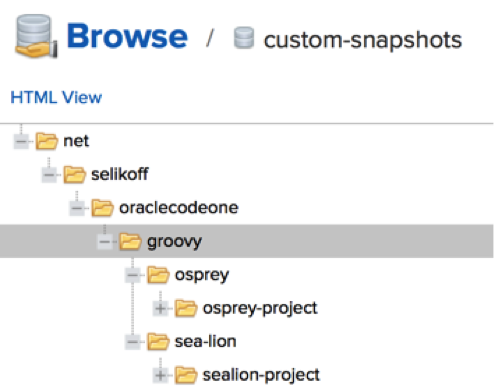
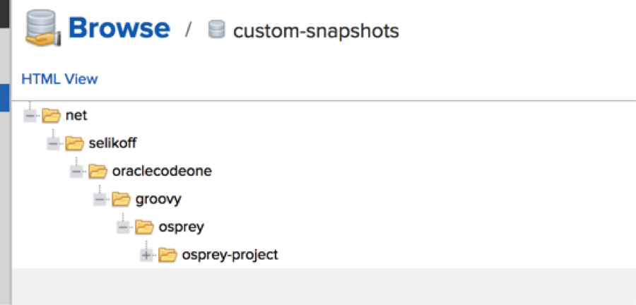

## Step 6 – Create a Jenkins pipeline

### 6.1 - Setup Nexus Credentials in Jenkins

1. In the left navigation bar, click &quot;Credentials&quot;

1. Click &quot;Jenkins&quot;
 

1. Click &quot;Global credentials (unrestricted)&quot;

1. Click &quot;Add Credentials&quot;

1. Enter the username/password for Nexus (the one we set in the Groovy script). For id, make sure to name it &quot;nexus&quot;.

### 6.2 - Create a job to setup jobs with proper configuration

Teams at our imaginary company always start out with the same types of build – pull from github and run a gradle clean/install/publish. To save them some time, let&#39;s create a meta-job that can generate Jenkins jobs with the build pipeline pre-configured.

1. Create a new job named &quot;job-generator&quot;

1. Select &quot;freestyle project&quot; as the type.

1. Select &quot;this project is parameterized&quot;

1. Add a string parameter with the name gitUrl and the description &quot;URL in GitHub&quot;

1. Add another string parameter with the name gitFolder and the description &quot;Subfolder name within GitHub project&quot;

1. Add a build step to execute a system groovy script.

1. Paste in the script from this URL
[https://github.com/boyarsky/OracleCodeOne2018-HOL-Automating-Stack-Groovy/blob/master/jenkinsScripts/jobGenerator.groovy](https://github.com/boyarsky/OracleCodeOne2018-HOL-Automating-Stack-Groovy/blob/master/jenkinsScripts/jobGenerator.groovy)

*if you are running with a Nexus port other than 8081, see [note in appendix IV](appendix-1v-different-ports.md)*

8. Save

1. Click &quot;Build with parameters&quot; to run this job twice.

Set the gitUrl as follows:

**https://github.com/boyarsky/OracleCodeOne2018-HOL-Automating-Stack-Groovy.git**

Set the gitFolder as follows:

**osprey-project**
 

9. Run the job again, but enter **sea-lion-project** for the gitFolder.

### 6.3 - Testing Access and Running Jenkins Jobs

Now that we have jobs and security, we can try everything out.

1. Logon to Jenkins as Sophia.

1. Confirm this user can see both the Osprey and Sea Lion job.

1. Run the Sea Lions job and ensure it passes.

1. Log out.

1. Logon as Olivia.

1. Confirm this user can see the Osprey job, but not the Sea Lion job.

1. Run the Osprey job and ensure it passes.

### 6.4 - Testing access and Viewing Nexus artifacts

1. Logon to Nexus as an admin.

1. Click Browse -> Custom Snapshots

1. Then drill down and see both artifacts were deployed.
 

1. Now login as Olivia. Drill down and confirm she can&#39;t see the sea lion project.
 

1. Next logout. Refresh the page and try to go to browse again. Note that this time you can&#39;t see anything, not even the repository.

1. Finally, login as Sophia and confirm you can see both the osprey and sea lion projects.

### 6.6 - Editing a pipeline job

The Sea Lions have decided they want to deploy to Nexus on every other build. For even numbered builds they want to just print a message to the console that they are skipping deploy. For odd numbered builds, they want the pipeline to behave normally.

_Tip_: This is the code to get the build number.

def buildNum = env[&#39;BUILD\_NUMBER&#39;] as Integer

To validate:

- Run the sea lion job twice

- For the odd numbered job number, confirm &quot;skip publish&quot; is in the log.

- For the even numbered job number, confirm :publishMavenPublicationToSnapshotsRepository is in the log.